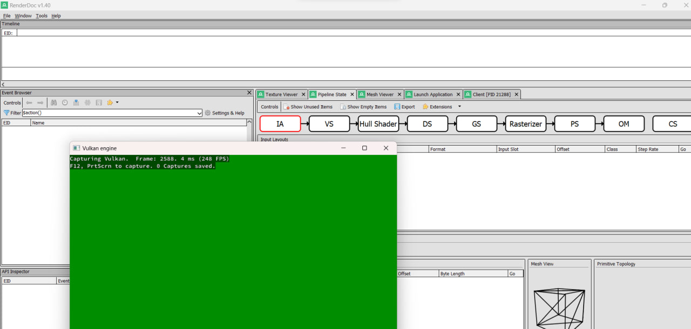

# Kvazar 🚀
**Game Engine on Vulkan**

Kvazar is an experimental game engine written in **C++** using the **Vulkan API**.  
The goal of the project is to create a modern and flexible architecture for working with graphics, shaders, and resources, as well as to explore low-level GPU management practices.

---

## 🔧 Tech Stack
- **Language:** C++  
- **Build System:** CMake  
- **Scripts:** `.bat` files for automation and debugging  
- **Debugging & Profiling:**  
  - [RenderDoc](https://renderdoc.org/) — frame capture and analysis  
  - [NVIDIA Nsight Graphics](https://developer.nvidia.com/nsight-graphics) — GPU profiling and resource inspection  

---

## 📦 Third-Party Libraries
- **[GLFW](https://www.glfw.org/)** — window creation and input handling  
- **[spdlog](https://github.com/gabime/spdlog)** — high-performance logging  
- **[vk-bootstrap](https://github.com/charles-lunarg/vk-bootstrap)** — simplifies Vulkan initialization (instance, device, swapchain)  
- **[Vulkan Memory Allocator (VMA)](https://github.com/GPUOpen-LibrariesAndSDKs/VulkanMemoryAllocator)** — memory allocation and management  

---

## 🎯 Roadmap
- Architecture for handling **shaders**  
- System for managing **graphics pipelines**  
- Support for **descriptor sets and pools**  
- Extended debugging and profiling tools  

---

## 🖼️ Debugging & Profiling

### First Experience with **NVIDIA Nsight**


Description: connecting to the process, capturing GPU Trace, analyzing resources and pipelines. Nsight helps identify bottlenecks and verify correct memory usage and synchronization.  

---

### First Experience with **RenderDoc**


Description: capturing a frame, inspecting draw calls, analyzing buffer and texture contents. RenderDoc is convenient for step-by-step rendering analysis and verifying data correctness.  

---

## 🚀 How to Build
```bash
git clone https://github.com/yourname/Kvazar.git
cd Kvazar
cmake -B build
cmake --build build
